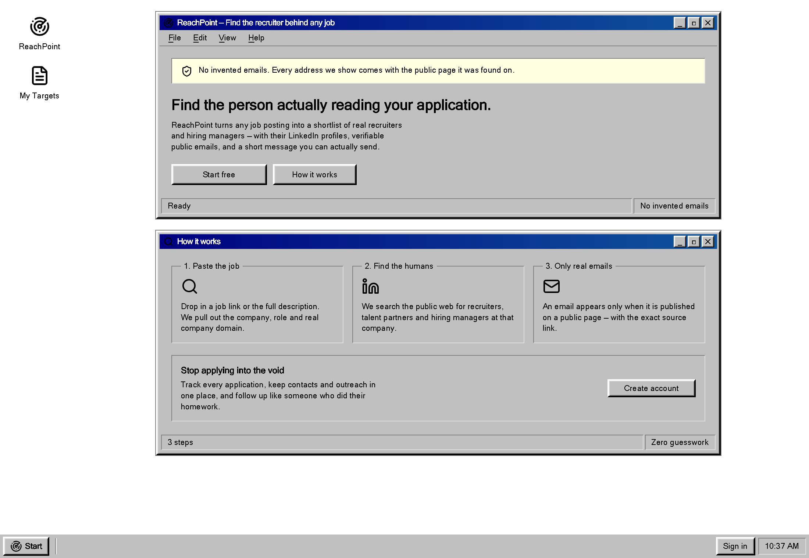
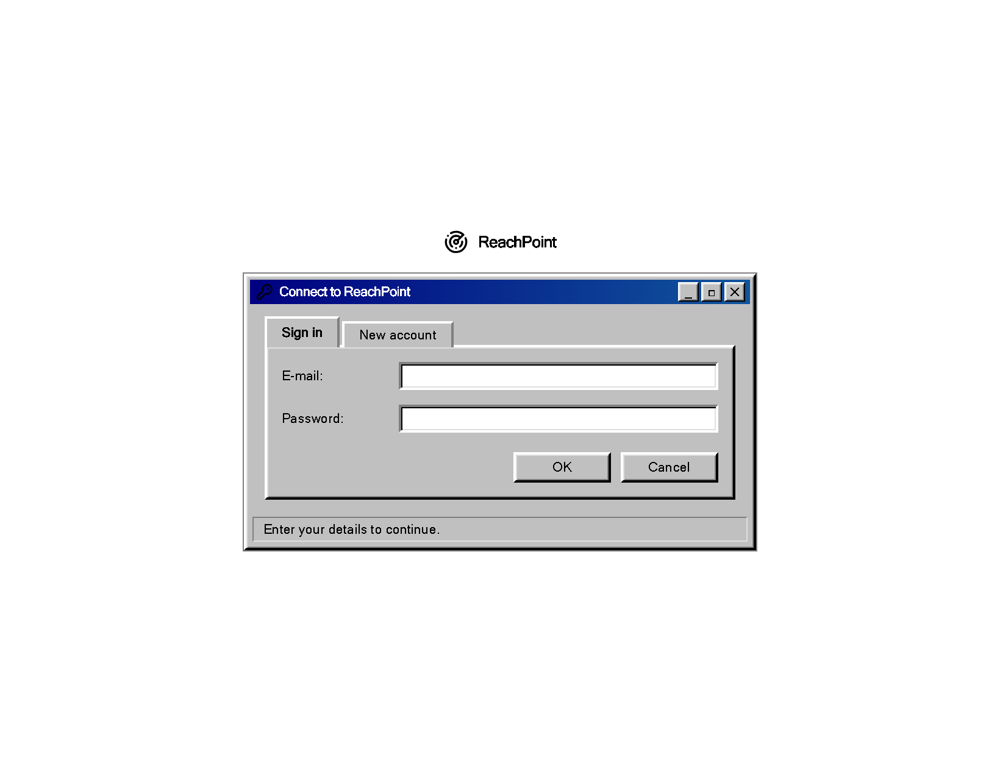

# ReachPoint

[](https://github.com/MoOnTheGo404/job-seeker-superpowers/actions/workflows/ci.yml)

**Paste a job posting. Get the actual humans behind it.**

ReachPoint turns any job link into a shortlist of real recruiters — and of senior people on the
team who could refer you — with their LinkedIn profiles, any publicly published email, and a
short outreach message you can actually send.

Styled as a Windows 95 desktop, because job hunting is bleak enough already.



## The one rule

**Email addresses are never guessed.** No `firstname.lastname@company.com` pattern-matching.
An address appears only if it was found published on a public page, and it is always stored and
displayed with the URL it came from (`email_source_url`). When nothing verifiable exists, the app
says so and points you at LinkedIn instead.

The same rule applies to the drafts: the model is instructed never to invent your background.
Anything it doesn't know comes back as a `[bracketed blank]` for you to fill in, because a visible
gap is recoverable and a confident fabrication is not — that message goes to a real person under
your name.

## What it does

1. **Parse the posting** — paste a link or the raw text. Gemini extracts the company, role,
   department and the company's real website domain, ignoring the job board it was posted on.
2. **Find recruiters** — searches the public web for recruiters, talent partners and hiring
   managers at that company, and crawls the company's own site for published recruiting inboxes.
3. **Find referrers** — separately searches for _senior people in the job's own department_,
   ranked so a Director on the actual team outranks a more senior stranger elsewhere. Recruiters
   are filtered out; these are the people who could vouch for you.
4. **Draft the message** — a short, specific note per contact. Referral asks get their own
   framing, since asking a stranger for a favour is not a shorter version of applying.



## Some things that were more interesting than expected

- **Search operators are a paid feature.** Serper's free tier rejects both `site:` and quoted
  phrases. Every discovery query used both, and the failure was _silent_ — the code treated any
  non-OK response as "no API key configured" and fell back to scraped search engines, returning
  nothing. Queries are now operator-free and the fallback logs loudly.
- **Pinned model IDs rot.** `gemini-2.0-flash` and `gemini-2.5-flash` both 404 for new API keys.
  The default is the `gemini-flash-latest` alias instead.
- **Thinking is worth turning off sometimes.** Job parsing is pure field extraction and gains
  nothing from it, at roughly 9× the latency — measured 7.9s versus 0.9s on the same prompt.
  It stays on only where prose quality matters.
- **`??` is not `||`.** A declared-but-blank `GEMINI_MODEL=` in `.env` is an empty string, which
  `??` passes straight through; the API then rejects the request for having no model.

## Stack

- **Frontend/SSR:** TanStack Start (React 19) on Vite, Tailwind CSS v4, shadcn/ui
- **Backend:** Supabase — Postgres, Auth, row-level security on every table
- **AI:** Google Gemini via `@google/genai`
- **Search:** Serper, with scraped search engines as a degraded fallback

## Running it

Requires Node.js 20+.

```sh
npm install
cp .env.example .env    # then fill in the values
npm run dev
```

Runs on http://localhost:8080.

You need a Supabase project (apply the migrations in [supabase/migrations](supabase/migrations)),
a [Gemini API key](https://aistudio.google.com/apikey), and a [Serper key](https://serper.dev).
Both AI and search have free tiers that need no credit card. See [.env.example](.env.example).

`SERPER_API_KEY` is nominally optional but effectively required — without it, discovery falls back
to scraping search engines that throttle heavily, and usually returns nothing.

| Command             | What it does                      |
| ------------------- | --------------------------------- |
| `npm run dev`       | Start the dev server on port 8080 |
| `npm run build`     | Production build                  |
| `npm run typecheck` | Type-check without emitting       |
| `npm test`          | Run unit tests (Vitest)           |
| `npm run lint`      | Lint with ESLint                  |
| `npm run format`    | Format with Prettier              |

## Deploying

Built for **Cloudflare Workers** (`cloudflare_module` nitro preset). Cloudflare fits this
workload specifically: it bills CPU time rather than wall time, and discovery is almost
entirely spent waiting on the network, so a run lasting half a minute costs almost no
billable compute. Hosts that cap wall-clock function duration are a worse fit.

Connect the repo under **Workers & Pages** with:

- **Build command:** `npm run build`
- **Deploy command:** `npx wrangler deploy`

Environment variables go in **two** places, and both are required:

- **Build variables** — the three `VITE_`-prefixed values. Vite compiles these into the client
  bundle at build time, so they cannot be added afterwards; changing them needs a rebuild.
- **Variables and secrets** (runtime) — the unprefixed `SUPABASE_*` plus `GEMINI_API_KEY` and
  `SERPER_API_KEY`. Mark the last two as encrypted secrets; they must never be `VITE_`-prefixed
  or they would ship to the browser.

Override the target with `NITRO_PRESET` — `node-server` for a container, `vercel` for Vercel.

The free Workers tier allows **50 outbound subrequests per invocation**; the discovery
fan-out is sized to stay under it (~40 worst case, far fewer once the search cache is warm).

## Layout

```
src/lib/discovery.parse.ts   Pure parsing — no network, no env, no clock. Unit tested.
src/lib/discovery.server.ts  Search and crawl. Server-only.
src/lib/recruiters.functions.ts  Four server functions: analyze, discover, refer, draft.
src/lib/security-headers.ts  CSP and friends, applied to every response.
src/lib/ai.server.ts         Gemini client, retry and error mapping.
src/components/win95/        Window chrome: title bars, group boxes, status bars.
src/styles.css               The Win95 design system — it is all bevels.
supabase/migrations/         Schema. RLS scopes every row to its owner.
```

The parsing logic lives apart from the I/O deliberately: the email regex, the LinkedIn
`Name - Headline | LinkedIn` split and the JSON fallback parser are the parts most likely to break
quietly, and keeping them pure means they can be tested directly.

## Database

Six tables. Four hold user data — `profiles`, `job_targets`, `contacts`, `outreach` — each with
row-level security scoping rows to their owning user. Recruiters and referrers share the
`contacts` table, separated by `contact_type`. Two more support the free tiers: `search_cache`,
shared across users with a 7-day TTL, and `rate_limits`, strictly per-user.

## Security

Job postings are written by strangers and go to a language model, so the untrusted-text boundary
gets explicit treatment: third-party content is fenced and length-capped, and every domain the
model returns is validated before anything crawls it.

The interesting part is what does **not** work. Requiring a returned email to appear in the
fetched page passes the real attack untouched — the model never emits an address, and the
exploitable path is it naming the wrong site as the employer, after which real addresses get
harvested from a page the attacker controls. [SECURITY-NOTES.md](SECURITY-NOTES.md) has the full
account, including what an attacker can still do.

## Origin

This began as a Lovable-generated scaffold, and the scaffold was a working application rather
than a starter template — three of the four server functions, a discovery pipeline, four tables
with RLS and all four routes already existed in the first commit. What changed since is the part
that decides whether software survives contact with reality.

Rough attribution, measured with `git blame` against that first commit rather than estimated:

|                  | Count | Note                                     |
| ---------------- | ----- | ---------------------------------------- |
| Commits          | 30    |                                          |
| Tests            | 80    | The scaffold had none                    |
| Pure parsers     | 24    | 15 written here, 9 inherited             |
| Server functions | 4     | `discoverReferrers` written from scratch |
| Tables           | 6     | 4 inherited, 2 added                     |

Excluding the 46 vendored shadcn/ui components, about 60% of the current tree was written here.
Including them, about 34%.
